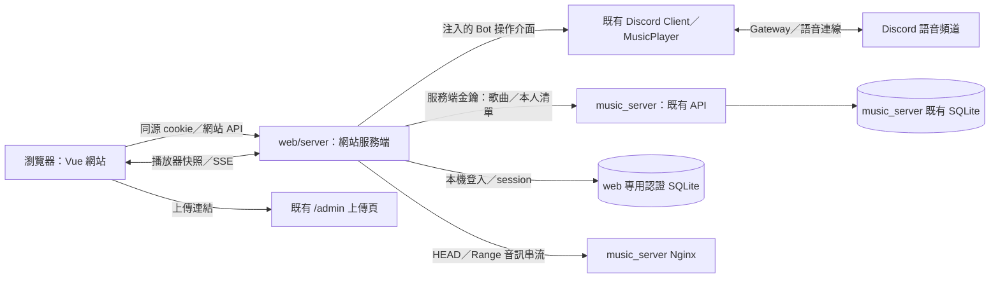

# Cirno 音樂播放器網站計劃書

版本：v1.5 已核准實作基準（依最新註冊與密碼需求修正）
日期：2026-10-10（台灣時間）
實作分支：`dirtyroad0329/Cirno_Discord_Bot:webGui`；`music_server:webGui` 作為相容性驗證基準，首版不修改
目前階段：使用者已核准實作；本檔保存設計基準。已完成項目、測試結果及尚需正式環境驗收事項見[驗證紀錄](testing.md)。

## 1. 目標與已確認的決策

建立 Cirno 專用音樂網站，讓使用者透過較完整的網頁介面搜尋曲庫、管理自己的播放清單、在瀏覽器聽歌，以及控制 Discord 語音頻道中的 Cirno Bot。**Discord 語音播放及其網頁控制是最高優先功能**。

已依使用者補充確認：

- 登入只使用 **Discord 使用者 ID＋密碼**，新帳號使用已確認的共用預設密碼，僅由服務端設定且不在網站提示；使用者可自願修改密碼。
- 不使用 Discord OAuth、不連結個人 Discord 帳號，也不進行 Discord 驗證碼或本人身份驗證。
- 「上傳歌曲」直接導向 `music_server` 已有的上傳網頁，不在新網站重做上傳。
- 歌曲與播放清單仍以 `music_server` 為唯一資料來源；網站帳號、密碼與 session 改由 Cirno 的 `web/` 專用 SQLite 保存，認證程式、結構定義、migration、管理 CLI 與測試也全部放在 `web/`。
- 依本次修正，首版不修改 `music_server` 的程式、API、Prisma schema、migration、設定或部署檔。原稿「所有新增永久資料都放在 music_server」調整為以上分工，不直接連線或寫入 music_server 的 SQLite。
- 本專案新增的網站環境變數集中在 `web/.env`，範例放在 `web/.env.example`；Bot 既有設定保留根目錄 `.env`，不因網站功能搬動或覆寫。
- 使用者已授權功能實作、單元／整合測試及更新遠端 `webGui`，並要求移除先前只有計劃書的 commit 紀錄。本次不部署，也不遷移正式資料庫。

登入後的 Discord ID 是網站帳號識別值。網站依密碼認證該帳號，再讓 Bot 查詢該 ID 的語音狀態；此流程**不代表已證明登入者擁有該 Discord 帳號**。共用的初始密碼在修改前也無法提供本人識別保障。依使用者要求，本計劃不以外部 Discord 驗證補足這項限制。

### 1.1 原始需求對照

| 使用者要求 | 本計劃的落實方式 |
| --- | --- |
| 網頁獨立資料夾 | 在 Bot 庫頂層新增 `web/`，分開前端、網站服務端、契約、測試與建置設定 |
| 操作類似 YouTube Music／Spotify | 採曲庫、搜尋、個人清單、底部播放器與播放裝置選擇；使用 Cirno 自有配色與版面 |
| 資料庫以 music_server 為主 | 歌曲、清單僅保存於既有 music_server；依最新指示，網站專用帳密／session 保存於 web/，不建立音樂資料副本 |
| 不修改現有 music_server API | 直接沿用 `/v1/songs`、`/v1/playlists` 與既有上傳頁；首版無須新增 music_server API 或資料表 |
| 搜尋／全庫／清單／播放 | 網站提供四項完整流程，不限於 Discord 選單的項目數與互動形式 |
| Bot 加入目前語音頻道，網站控制 | 共用現有 Bot Client、播放器及 guild session；後端決定使用者所在頻道 |
| Discord ID／註冊／改密碼 | ID-only 網頁註冊、一般帳密登入、自願改密碼與登出；不提示預設密碼 |
| 不可改刪歌曲，只能改自己清單 | 網站後端只開放歌曲讀取；清單 owner 從登入 session 取得 |
| 遇歧異即時提出或採最佳方案 | 明確列出本稿假設、技術限制與審閱項目，不將假設描述成既有功能 |

## 2. 現況與規劃基準

本次檢查的是已同步上游的 `webGui` 分支快照，不使用環境中較舊的本機 `work` 分支作為功能基準。

| 程式庫 | 檢查版本 |
| --- | --- |
| `Cirno_Discord_Bot` | `0680603a46e49e1be27cc50b05b6976a340fe9ad` |
| `music_server` | `42958ed99367be07cebc4c3e05c45c10f1e05289` |

依據兩庫 README、架構文件、實際程式與使用者提供的 `pragmatic-modular-architecture` 文件規劃。實作啟動時應再 fetch 並確認分支差異，保留尚未提交的本機工作。

### 2.1 可以直接沿用的功能

- Bot 已有遠端曲庫查詢、播放與個人播放清單整合。
- 每個 Discord guild 已有唯一音樂工作階段、操作序列化、語音租約及資源清理。
- 已有暫停／繼續、上一首／下一首、重播、跳轉、音量、循環、隨機與佇列編輯。
- `music_server` 已有完整歌曲及個人清單 API；清單以 Discord ID 歸屬，寫入使用 `revision` 防止覆蓋。
- 清單上限為每人 20 份、每份 100 首；待播佇列最多 100 首，與清單內容是不同狀態。
- 歌曲串流由 `music_server` 的 Nginx 負責，已有 HEAD／Range 支援。
- 後端已有 `/admin` 上傳頁，使用獨立 `ADMIN_TOKEN`。

### 2.2 實作需要補上的能力

- 網站前端、帳密登入、密碼修改與 session。
- Bot 與網站共用的播放操作入口，不依賴 Discord interaction。
- 不需要指定 Discord 文字頻道的語音播放啟動方式。
- 可安全序列化的播放器狀態、狀態同步與網站操作的過期檢查。
- 保留 HTTP Range 的瀏覽器音訊串流代理。
- 網站獨立的建置、啟動、停止與部署設定。

## 3. 功能範圍與優先順序

### 3.1 首版必須完成

1. 只填 Discord ID 的網頁註冊、登入、登出及自願改密碼。
2. 依標題／演出者搜尋；游標分頁瀏覽目前可用的全曲庫。
3. 建立、查看、重新命名及刪除自己的播放清單。
4. 清單加入歌曲、移除收藏、調整順序及整份播放。
5. 選擇「Discord 語音」或「此瀏覽器」播放目標。
6. Bot 加入登入帳號 ID 目前所在的一般語音頻道。
7. 網頁操作 Bot 播放、暫停、繼續、跳曲、重播、進度、音量、循環及隨機。
8. 網頁查看與調整 Discord 共用待播佇列。
9. Discord 指令／按鈕與網站操作同步到同一個 Bot 播放器。
10. 上傳入口導向既有後端上傳頁。

先完成「登入 → 查詢歌曲 → 在 Discord 語音播放 → 網頁暫停／跳曲 → Discord 同步」的垂直流程，再擴充其餘功能；瀏覽器播放也屬首版交付範圍。

### 3.2 首版不新增的產品能力

不串接 YouTube Music／Spotify 的歌曲來源、帳戶、訂閱或匯入 API。相似之處限於操作習慣。

不增加歌詞、推薦演算法、公開清單、社交分享、付費權限、多 Bot 叢集或多 guild 混音。現有歌曲沒有專輯與封面欄位，因此不將虛構的專輯或封面當作後端資料。

## 4. 頁面與操作設計

### 4.1 視覺方向

採深色底、冰藍色重點與 Cirno 識別，保留自己的視覺風格。桌面使用左側導覽、中央內容、可展開的右側佇列與底部播放器；手機改為精簡導覽、迷你播放器與全屏佇列。

導覽包含「曲庫」「搜尋」「我的清單」「設定」，右上顯示登入帳號及上傳入口。缺少封面時使用統一的歌曲圖示或簡單色塊，不產生假資料。

### 4.2 主要頁面

| 頁面 | 內容與操作 |
| --- | --- |
| 登入 | Discord ID、密碼、登入；ID 必須以字串處理，避免 snowflake 數值精度損失 |
| 註冊 | 只填 Discord ID，不顯示或要求密碼；成功後回登入頁，登入直接使用播放器 |
| 曲庫 | 歌曲名稱、演出者、已知時長；播放、下一首、加入佇列、加入清單、載入更多 |
| 搜尋 | 依名稱／演出者即時查詢，處理 loading、空結果、失敗及過期回覆 |
| 我的清單 | 清單列表、建立／重新命名／刪除、曲目排序、加入歌曲及整份播放 |
| 播放器 | 明確顯示播放目標、目前歌曲、進度、控制列、循環與音量 |
| 佇列 | 顯示目前歌與待播項目；移除、拖曳排序、清空待播；手機亦提供上下移動按鈕 |
| 設定 | Discord ID、修改密碼、登出；不顯示任何後端服務金鑰 |

所有重要控制提供可讀名稱、鍵盤操作與焦點提示。音量及拖曳進度在提交時送出操作，不因每一個滑動事件大量呼叫後端。

### 4.3 播放目標

播放器預設提供 **Discord 語音** 為主要選項；首次進入頁面不自動播歌。點擊歌曲前即可切換到「此瀏覽器」。

- 切換到 Discord 控制時，暫停此瀏覽器音訊，避免使用者意外聽到兩路播放。
- 切換到瀏覽器時，不自動停止共用的 Bot；必要時提示「語音頻道仍在播放」。
- 瀏覽器播放音量與佇列屬於該頁面；Discord 音量與佇列屬於該 guild 共用工作階段。
- 關閉頁面或登出會停止本頁音訊並釋放連線，不替其他成員停止 Bot。

## 5. 架構與資料所有權

### 5.1 技術選擇

網站前端使用 Vue 3＋TypeScript＋Vite。多頁功能與播放器共用狀態由功能 composable 管理，首版不另引入大型狀態框架。

網站服務端使用 Node.js 22.12+／TypeScript／Fastify，作為網站的專用 API 入口（BFF）。它處理登入、cookie、授權、媒體代理及 Bot 操作，並只直接存取自己在 `web/` 管理的認證 SQLite；歌曲與清單一律透過既有 music_server API，不連線其資料庫。

**首版預設：網站服務端和既有 Bot 共用同一個 Node 程序、Discord Client 與 MusicPlayer。** 這是減少接合與維運複雜度的選擇，不是網站技術本身只能如此部署。完整的 Discord 控制必須有正在運行的 Bot；若網站與 Bot 分成兩個程序，還需要明確的 HTTP／IPC 通訊介面，不能直接 import 同名 singleton 就取得另一程序的工作階段。

網站前端、網站服務端與 Bot 是三個不同責任。Vue 靜態資產或開發伺服器可獨立提供；登入、曲庫、清單與瀏覽器播放也沒有必須依賴 Discord Gateway 的技術條件。但首版的正式網站服務端採同程序接合，因此它在此啟動模式下會和 Bot 一起運行；獨立網站程序＋Bot 通訊橋接目前不列入首版實作。

啟動組裝入口放在 `web/server/entry.ts`：先準備設定，再呼叫既有 `startBot()` 一次，取得 Client／公開播放器能力，最後啟動網站。既有根目錄 `npm start` 維持 Bot-only；未來新增的 web 啟動指令提供 Bot＋網站模式。兩者擇一啟動，不先執行根目錄 npm start 再啟動另一份 web＋Bot。

正式部署優先採現有 Bot 主機上的同源網站入口及 HTTPS 反向代理。這個網站需要存取 Bot 的記憶體工作階段，首版不採獨立的無狀態 Worker 託管。

### 5.2 資料流



| 資料或資源 | 唯一所有者 | 保存方式 |
| --- | --- | --- |
| 歌曲與音檔 | music_server／其 Nginx | 沿用現有 DB／音檔目錄 |
| 個人清單與 revision | music_server | 沿用現有 Playlist／PlaylistEntry |
| 網站帳號、密碼雜湊、session | web/server/auth | web 專用 SQLite；不包含歌曲或清單副本 |
| Discord 音樂、佇列、連線、計時器 | 現有 MusicPlayer／guild session | 程序記憶體，重啟後不續播 |
| 瀏覽器播放器與待播佇列 | 當前網頁的 playback composable | 頁面記憶體 |
| 查詢、頁面選取與表單 | 對應功能 composable／元件 | 頁面記憶體 |
| 登入 cookie | 瀏覽器持有 opaque token；後端驗證 | HttpOnly cookie，後端只保存 token hash |

### 5.3 預計目錄

以下是責任配置，不要求機械式建立所有檔案或空資料夾。

```text
Cirno_Discord_Bot/
├── src/                         既有 Bot 程式，保留現有架構
│   ├── app/                     保留 Bot 啟動；按需支援外部入口管理停止
│   └── features/music/
│       ├── application/         中立的播放操作與狀態出口
│       ├── playback/            既有唯一播放器；補網站操作 context
│       └── presentation/        既有 Discord 面板與指令呈現
├── web/                         新增的網站專用目錄
│   ├── client/
│   │   └── src/
│   │       ├── pages/           曲庫、搜尋、清單、設定
│   │       ├── components/      共用導覽與播放器元件
│   │       ├── features/        auth、catalog、playlists、playback
│   │       └── api/             同源網站 API client
│   ├── server/
│   │   ├── entry.ts             Bot＋網站的單程序組裝入口
│   │   ├── config/              解析 web/.env，產生網站專用設定物件
│   │   ├── auth/                登入、密碼、cookie、session、CSRF
│   │   │   ├── storage/        web 認證 DB 存取、結構定義
│   │   │   ├── migrations/     僅升級 web 認證 DB
│   │   │   └── cli.ts          管理者建立／停用／重設網站帳號
│   │   ├── catalog/             歌曲讀取、串流代理
│   │   ├── playlists/           本人清單操作
│   │   ├── playback/            Bot 操作、快照、SSE
│   │   └── integrations/        music_server client、注入的 Bot 能力
│   ├── contracts/              瀏覽器使用的網站 DTO
│   ├── tests/                  包含認證、資料保存、API 與 UI 驗證
│   ├── deploy/                 網站主機的反向代理／掛載範例，按需建立
│   ├── data/                   預設 auth.sqlite／WAL；執行期資料，gitignore
│   ├── .env                    網站設定；不提交、不供瀏覽器下載
│   ├── .env.example            網站設定範例，不包含真實金鑰
│   └── package.json            網站依賴、獨立建置設定
└── docs/                        架構與部署說明

music_server/                    維持現狀，沿用既有 API、DB 與上傳頁
```

前端不得 import Discord 類別或 Bot 私有實作。網站服務端依注入的介面呼叫 Bot；Bot 功能模組不反向依賴網站。`src/app` 保留 Bot 自身的啟動與生命週期；網站／Bot 組裝放在 web 的 entry，不把網站 HTTP／登入邏輯放進 src/。

Bot 公開能力及中立型別由 Bot 的 `src/features/music/api.ts` 或其公開型別出口擁有；`web/contracts` 只擁有瀏覽器 DTO。由 web entry 取得 Bot 公開能力並注入符合網站介面的 adapter，Bot feature 不 import `web/contracts`。兩邊的型別接合在組裝建置中驗證，不暴露 Discord／播放器內部類別。

現有 Bot `tsconfig.json` 的 `rootDir`／`include` 只有 `src`。因此 `web/` 使用獨立 TypeScript 設定與產物，不將網站程式塞入原 Bot 編譯範圍。網站 entry 載入已建置的 `dist/app/bootstrap.js` 與公開 Bot 模組，不能匯入會自動啟動 Bot 的 `src/index.ts`／`dist/index.js`。兩邊各自建置後驗證組裝與型別邊界，保留原本只啟動 Bot 的路徑。

現有 Bot 的 declaration 設定為 false，跨建置的公開能力型別尚未自動產生；實作時須補明確的型別出口或組裝型別檢查，並固定建置順序，不能假定直接 import dist/ 已具有完整型別。這屬公開契約與建置接合，不將網站前端或 HTTP 模組搬進 src/。

### 5.4 啟動依賴與 src/ 的必要接合

| 啟動情況 | 需要 Bot 運行嗎 | 本計劃的安排 |
| --- | --- | --- |
| 只運行既有 Discord Bot | 是，只有 Bot 自己 | 根目錄 npm start 維持 Bot-only，不需要網站建置或 web/.env |
| 首版完整網站＋Discord 語音控制 | 是 | 同一 Node 程序啟動既有 Bot 與網站 HTTP listener，不另登入第二個 Bot |
| 前端開發伺服器 | 不一定 | UI 可獨立運行；需要真實 Bot 控制時，連接上述網站 API |
| 完全獨立的正式網站程序 | 只聽瀏覽器音訊時不需要；控制 Bot 時需要 | 技術可行，但需另建 Bot HTTP／IPC 橋接，非首版預設 |

src/ 的修改限於以下接合，不將網頁業務邏輯放入 Discord 程式：

1. **停止生命週期接合**：網站的啟動組裝在 web/。目前 bootstrap 自己註冊 signal handler，因此為 startBot 提供由呼叫者管理停止的選項，原啟動預設保持不變；完整模式由 web entry 負責先清理網站再停止 Bot，避免兩個停止流程競爭。src/index.ts 不需要為網站增加自動啟動邏輯。
2. **公開能力與安全狀態出口**：提供網站可呼叫的播放操作與純資料快照；不要讓網站直接操作私有 sessions Map 或 VoiceConnection。
3. **不強制建立 Discord 文字面板的播放入口**：現有 enqueueMany 依賴文字頻道與面板發訊，網站播放只需要語音頻道。將音樂操作與可選 Discord 呈現分開，保留原指令行為。
4. **原子過期檢查**：網站的 sessionId／generation 檢查必須與真正操作一起放進既有 guild 工作佇列，才不會在 Discord 同時換歌後作用到錯誤 session；僅在 web/ 外圍先讀再檢查不足以消除競爭。

登入、帳密、網站 DB、網站路由、音訊代理、Vue 元件與網站設定全部留在 web/。不複製播放器、不將既有指令搬進 web/，也不修改無關的 AI／複製文功能。就算改為獨立網站程序，Bot 仍需提供通訊端的播放能力與相同並行保護，所以拆程序也不會使所有 src/ 接合自動消失。

### 5.5 可停用與可移除的設計要求

**同一程序不等於雙向依賴。** 依賴方向固定為 `web → Bot 公開能力`；網站啟動入口擁有組裝，Bot 的 src/、型別、建置與原測試不依賴 web/ 是否存在。

- src/ 不 import web 的程式、contracts、設定、HTTP 框架或認證 driver，不讀取 web/.env，也不要求網站 DB 已建立。
- Vite、網站 Fastify、SQLite driver 等新增網站依賴放在 web/package.json 與其獨立 lockfile；根目錄 Bot 的 npm ci 不要求安裝網站套件，不以 workspace 綁定網站安裝。
- 根目錄不新增對 web/ 的 file: 依賴；原 install／build／typecheck／test／start／production 檢查流程不強制進入 web/。若提供整合建置捷徑，必須是明確選用的指令。
- Bot 的 TypeScript 設定、公開型別與原測試可在沒有 web 原始碼或產物的情況下建置。網站的整合型別檢查與網站測試由 web/ 的指令負責，根目錄原檢查不強制呼叫它們。
- src/ 的播放入口、可選面板、session／generation 檢查與停止選項都是中立能力；移除網站後仍可保留，不需要逐一回滾播放器重構。Discord 的既有預設行為維持不變。
- 網站模組提供獨立、可重複呼叫的 dispose，只釋放自己的 HTTP、SSE 訂閱、瀏覽器音訊代理與認證 DB；不得自行 shutdown 共用 MusicPlayer 或 destroy Discord Client。完整程序停止由 web entry 依序呼叫網站 dispose 與 Bot stop。

預計停用／移除的操作範圍：

| 目的 | 操作 | Bot 核心是否需要回改 |
| --- | --- | --- |
| 停用網站 | 停止目前完整程序，改用根目錄 npm start；亦可在 web/.env 設 WEB_ENABLED=false 再以完整入口重啟 | 否；原啟動預設就不載入網站 |
| 移除網站 | 先切回根目錄啟動，再移除 web 程式與網站專用部署設定；如有網站啟動捷徑，只清理該捷徑 | 否；中立播放能力可留下 |
| 暫時停用後恢復 | 保留網站認證 DB 與設定，恢復 web 模組、建置及完整入口 | 否；歌曲與清單一直保存在 music_server |

移除程式前先保存 web/.env 與認證 DB，可放到受控備份或原 WEB_AUTH_DB_PATH 的持久位置；移除網站程式不等於刪除帳號資料。網站反向代理／服務管理器設定也需停用或改回 Bot-only 的入口，music_server 不受此操作影響。

首版停用採正常停止／重啟切換，不加入環境檔監聽或熱插拔管理功能。重啟會結束目前 Bot 語音工作階段，沿用既有 Bot 重啟行為；不得宣稱切換入口可無中斷保留播放。

## 6. 登入、密碼與網站權限

### 6.1 網頁註冊

在登入頁提供「建立帳號」介面，只輸入 Discord ID。公開註冊 API 僅接受 `discordId` 字串，不接受密碼或其他欄位，驗證同源並限制帳號／來源／全域請求數。不連結或驗證 Discord 個人帳號，也不依既有清單自動建立帳號。

建立時：

1. ID 為 17–20 位數字字串，並以唯一鍵限制重複帳號。
2. 預設密碼依已確認要求由服務端設定，僅保存帶隨機 salt 的雜湊；網站 UI、提示及 HTTP 回應不顯示它。
3. 不設首次強制改密碼；註冊回應只有成功訊息，不簽發登入 cookie。成功後回到登入頁並保留 ID。
4. 既有同 ID 清單直接使用，不搬移、不重建，也不修改 ownerId。重複／並行註冊不重設已存在帳號。

帳號建立不要求 CLI，CLI 保留維護用途。網站帳號仍不代表已驗證 Discord 本人。

### 6.2 登入與改密碼

- ID＋密碼通過後簽發一般 session，可直接使用曲庫、清單及播放器；不接受瀏覽器自訂 ownerId。
- 不要求首次登入改密碼；使用者可在設定頁自願修改。
- 新密碼僅限 ASCII 英文字母或數字，至少 4 字元；不要求兩類字符混用。保留 1024 字元輸入上限。
- 設定頁要求目前密碼及確認新密碼；成功後原子更新 credential version、撤銷全部 session 並重新登入。
- 舊版已修改為含符號、空白或 Unicode 的密碼仍可登入及作為目前密碼；新規則僅驗證將設定的新密碼。
- 忘記密碼由管理者 CLI 重設為隨機英數密碼，可直接登入，不強制改密碼；不加 Discord 驗證、電子郵件或公開重設入口。
- 帳號停用拒絕登入並撤銷 session，不刪除歌曲或個人清單。
- Migration v3 保留帳號／雜湊／session，取消舊強制改密碼旗標並升級舊受限 session 權限，保留其原到期及撤銷狀態，不恢復已撤銷或停用帳號。

密碼使用非同步 `scrypt` 雜湊，session 使用高熵隨機 token，DB 只存其 hash、到期時間與撤銷狀態。

### 6.3 session 與請求保護

- 正式 HTTPS 使用 `HttpOnly`、`Secure`、`SameSite=Lax` 的同源 cookie；localhost 開發可有明確開發例外。
- 一般 session 最長 7 天、閒置 24 小時過期；升級舊受限 session 時保留原到期時間。
- 寫入操作檢查 CSRF token 及來源；註冊與登入同樣檢查來源，cookie 不存於 localStorage。
- 登入失敗採 ID／來源的限流與退避；回覆不區分「帳號不存在」與「密碼錯誤」。
- 不記錄密碼、session token、Bot token 或服務 API token；敏感回應使用 `no-store`。
- SSE 與音訊請求也需 session；session 撤銷／過期後不得接受新操作，既有網站連線需定期重新檢查並關閉。

### 6.4 清單與歌曲的授權

網站後端在 `web/server/auth` 驗證 cookie 對應的本機 session，取得網站帳號 ID，再為既有 music_server 清單 API 重建 `X-Discord-User-Id`。瀏覽器傳入的 ID、Authorization、owner header 不會被轉送。music_server 繼續只驗證原有 API_TOKEN 與 owner header，無須知道網站密碼或 session。

後端只允許以下操作：

| 資源 | 可用操作 | 限制 |
| --- | --- | --- |
| 歌曲 | 搜尋、查看、播放 | 不開放歌曲新增、修改、刪除或停用 |
| 清單 | CRUD、項目增刪／排序 | 僅登入帳號 ID 對應的清單；修改提交 revision |
| Bot 播放器 | 同語音頻道的播放與控制 | 每次操作由 Bot 檢查即時語音狀態 |
| 網站帳號 | 改自己的密碼、登出 | 管理者建立／停用不做公開 API |
| 上傳 | 連結既有上傳頁 | 新網站不保存或填入 ADMIN_TOKEN |

登入的帳號 ID 與 Discord 帳號本人的對應，受第 1 節所述的未驗證限制影響；清單授權本身仍依網站 session 限定帳號，不能宣稱已完成 Discord 本人認證。

## 7. music_server 零改動評估與 web 認證資料

### 7.1 是否有必須修改 music_server 的功能

**目前沒有。** 原稿把認證放進 music_server 是集中保存資料的架構選擇，不是登入或播放器功能的技術必要條件。依最新指示，將它改為網站專用資料保存，可減少跨庫修改與認證服務的網路依賴。

| 功能 | 現有能力／實作位置 | music_server 是否須改動 |
| --- | --- | --- |
| ID＋密碼、修改密碼、session | web/server/auth 與本機認證 SQLite | 否；音樂服務不需要認識網站密碼 |
| 搜尋、查看全庫 | 既有 songs 查詢、25 首一頁、cursor 接續 | 否；全庫瀏覽不必另加全量 API |
| 本人播放清單 | 既有 playlists API、API_TOKEN＋owner header、revision | 否；網站從本機 session 產生 owner header |
| 瀏覽器音樂與跳轉 | 既有 Nginx GET／HEAD／Range，web 做同源串流代理 | 否；無須對音樂服務增加 cookie／CORS／網站認證 |
| Bot 進入語音及網頁控制 | Cirno 的 Bot 操作介面、快照、SSE 與並行檢查 | 否；即時工作階段原本就在 Bot 程序 |
| 音檔格式相容 | 原生瀏覽器，必要時 web 端受控 FFmpeg | 否；轉碼不必移到 music_server |
| 上傳入口 | 導向既有 /admin；保留原管理金鑰操作 | 否；不重做上傳或新增寫入權限 |

首版不修改 music_server 的 API、schema、migration、設定、Nginx、Compose 或套件，也不直接讀寫其 SQLite 檔案。若未來需求超出現有 API，例如新增專輯資料或完整總數，再針對實際缺口評估最小變更；它們不是本次功能的必要條件。

### 7.2 沿用的既有 API

| API | 網站用途 |
| --- | --- |
| `GET /v1/songs?query=&cursor=&limit=25` | 搜尋及分頁瀏覽全庫 |
| `GET /v1/songs/:id` | 取得曲目 metadata，加入清單前核對歌曲 |
| `GET/HEAD /v1/songs/:id/audio` | 瀏覽器串流；仍由既有 Nginx 傳送 bytes |
| `GET/POST /v1/playlists` | 本人清單列表與建立 |
| `GET/PATCH/DELETE /v1/playlists/:id` | 讀取、改名與刪除清單 |
| `POST /v1/playlists/:id/entries` | 新增收藏 |
| `PATCH/DELETE /v1/playlists/:id/entries/:entryId` | 移動／移除收藏 |

不提高原有搜尋 limit，不改欄位、狀態碼、Bearer 授權或清單 revision 規則。全庫顯示使用 cursor 逐頁載入，並顯示「已載入 N 首」，不把已載入筆數當作全庫總數。首版不提供需要新增 count／album／artwork／全庫排序 API 的介面承諾。

### 7.3 僅在 web/ 新增的認證資料

程式與結構定義放在 `web/server/auth/storage/`，SQL migrations 放在 `web/server/auth/migrations/`，驗證放在 `web/tests/auth/`。不把 music_server 的 Prisma schema 搬過來，也不增加整套音樂 ORM。

| 模型 | 主要欄位與用途 |
| --- | --- |
| `WebUser` | `discordId`、`passwordHash`、`credentialVersion`、`mustChangePassword`、`disabledAt`、建立／密碼更新時間 |
| `WebSession` | session token hash、userId、credentialVersion、scope、建立／到期／最後活動時間、撤銷狀態 |

認證 DB 預設為 `web/data/auth.sqlite`，由 `WEB_AUTH_DB_PATH` 允許指定正式持久掛載路徑。CLI 與網站共用同一個路徑解析器；預設相對於 web 模組／專案位置解析，不能隨 shell cwd 改變而誤建第二份帳號資料。

使用支援 Node.js 22.12 基準的非同步 SQLite driver，例如相容版本的 `sqlite3`，並將 SQL 結構升級限制在自己的認證 DB。實作時需驗證最低 Node 版本、production 安裝與主機原生套件相容性，不以開發主機的較新 Node 版本代替此驗證。首版不依賴 Node 22.12 需要額外實驗旗標的 node:sqlite，也不讓同步資料庫等待占住 Bot 的事件迴圈。

密碼雜湊使用非同步 scrypt；網頁註冊、管理者重設、修改密碼、停用帳號與 session 撤銷由認證模組負責。修改密碼／重設／停用必須在同一筆寫入交易更新 credentialVersion 並撤銷 session。登入雜湊驗證後，建立 session 前再次在交易中檢查帳號版本與啟用狀態，防止舊密碼的進行中登入在撤銷後產生新有效 session。交易由明確的寫入協調者管理，避免 CLI／HTTP 交錯操作造成部分成功。

WebUser 與 WebSession 僅有本地帳號關聯，不建立跨 DB 外鍵；停用帳號或刪除 session 不影響 music_server 的 Playlist。認證 migration 只保存網站帳號／session 結構與版本，不包含 Song、Playlist、PlaylistEntry 的副本或其 migration。

web/data、DB 的 -wal／-shm、備份與任何執行期資料都加入 gitignore，不打包進前端或清除式 build 產物。網站靜態根目錄只指向 client 的建置資產，不能指向整個 web/；認證 DB 與備份不得被下載。

### 7.4 本地認證呼叫方式

瀏覽器使用第 8 節的 `/web/api/auth/login`、`me`、`password`、`logout`，由 web/server 直接呼叫本地認證模組。不另加 music_server 認證 API，也不增加跨服務的網站認證金鑰或遠端 session inspect 呼叫。

既有 `REMOTE_MUSIC_API_TOKEN` 繼續供 Bot／網站服務端呼叫歌曲與清單。網站先驗證自己的 session，再透過固定路由白名單調用既有 API。登出與修改密碼在本機撤銷工作階段，不需要 music_server 在線。

## 8. 網站專用 API 與串流

瀏覽器只呼叫同源 `/web/api/*`，不直接向 music_server 帶服務 token。以下是預計路由群組：

| 網站路徑草案 | 功能 |
| --- | --- |
| `/web/api/auth/login`、`logout`、`me`、`password` | cookie 登入與帳號設定 |
| `/web/api/songs`、`songs/:id` | 歌曲搜尋與查詢 |
| `/web/api/songs/:id/audio` | 認證後的 GET／HEAD 音訊代理 |
| `/web/api/playlists/*` | 本人清單操作 |
| `/web/api/voice/contexts` | 由 Bot 查詢該帳號 ID 所在的一般語音頻道 |
| `/web/api/player/:guildId` | 播放器完整快照 |
| `/web/api/player/:guildId/commands` | 白名單播放／控制操作 |
| `/web/api/player/:guildId/events` | SSE 狀態同步 |
| `/web/upload` | 固定設定的後端上傳頁重新導向 |

### 8.1 清單寫入

新增收藏只接收已存在的 songId，由網站服務端查詢 metadata 並填入正確的 `source=remote`、`library`、標題及演出者。不能接受任意外部曲庫 URL 或私有檔案路徑。

現有清單中若有 Bot 本地歌曲或其他遠端曲庫的收藏，保留原始資料與位置；網站可查看、排序或移除自己的收藏。瀏覽器只播放當前 music_server 可提供的曲目，其他項目明確顯示「此瀏覽器無法播放」。Discord 模式沿用 Bot 原有解析能力：可播放可讀的 Bot 本地歌曲與當前曲庫的遠端歌曲；其他 library 的收藏會略過並回報，不連線任意外部曲庫。

所有修改使用最後讀取的 `revision`。遇到 409 顯示「清單已被其他操作更新」，重新取得內容後由使用者決定是否重做，不自動覆寫。刪除確認使用當時 revision，衝突後重新確認。重複收藏以 entryId 區分，不以 songId 去重。

### 8.2 瀏覽器音訊

使用 HTMLAudioElement 管理瀏覽器音訊，加入 Media Session API 作為支援瀏覽器的附加操作。必須由使用者點擊觸發，不依賴瀏覽器允許自動播放。

代理上游必須是 `REMOTE_MUSIC_API_URL` 對應的 **Nginx 音訊入口**，不可直接使用 Fastify 的 3000 埠：原有 Fastify 回傳 `X-Accel-Redirect`，並不直接傳送音檔。

- 轉送受限的 Range／If-Range／條件快取標頭，支援 GET、HEAD 及 200／206／416。
- 保留必要的 Content-Type、Content-Length、Content-Range、Accept-Ranges、ETag、Last-Modified。
- 串流、背壓、上游逾時與中止；不把整首音訊讀入 RAM。
- 不轉送 Bot／服務金鑰、Set-Cookie、私有路徑或 X-Accel-Redirect。
- 上游 URL 僅由固定曲庫設定及合法 songId 組成，不實作任意網址代理。
- 關閉頁面、換歌與取消請求時，關閉對應上游串流。

原有 Bot 的 `openRemoteAudio` 不處理 Range、只接受 200，不能直接取代此網站代理。

首版先以目前版本 Chrome／Edge／Firefox 的桌面環境驗收，另測 iOS Safari 的格式差異。MP3、M4A/AAC、Opus/Ogg、WebM、WAV／FLAC 需以真實樣本檢查，不能以 Bot 能解碼就宣稱瀏覽器全部支援。

如原生瀏覽器無法解碼某格式，介面需顯示原因並提供改用 Discord 播放。若審閱要求所有既有格式都能在所有目標瀏覽器播放，則在發布前增加**網站端受控 FFmpeg 相容串流**：轉成瀏覽器可用格式、限制同時轉碼與暫存空間、取消時停止 FFmpeg；轉碼路徑的跳轉使用明確起始秒數，不宣稱維持原檔 Range。此擴充不要求修改 music_server API，但會增加 Bot 主機負載與驗收範圍。

## 9. 核心：由網站控制 Discord 語音播放器

### 9.1 語音播放流程

1. 使用者登入並選擇「Discord 語音」。
2. 網站後端取得 session 中的帳號 ID，呼叫已存在 Bot Client 的語音查詢能力。
3. Bot 僅從 Gateway voice state／可見 guild 資料解析該 ID，不讀取使用者 OAuth 或個人 Discord token。
4. 若未加入 Bot 所在 guild 的任何一般語音頻道，顯示「請先加入一個 Cirno 已加入的伺服器中的一般語音頻道」。
5. 若該 ID 同時出現在多個 guild 的語音頻道，要求選擇其中一個伺服器；不讓使用者任意輸入 channelId。
6. 點擊歌曲／清單後，後端核對曲目及即時語音狀態，在 guild 操作佇列內再次檢查，再加入／建立工作階段。
7. Bot 未播放時進入使用者所在頻道；同頻道已有工作階段則加入其佇列。
8. 如果另一頻道已在播放，提示加入 Bot 所在頻道；不搶走其他頻道的 Bot。
9. 回傳工作階段快照並建立 SSE，後續操作仍逐次檢查語音頻道。

一般語音頻道維持現有支援；Stage／私訊播放首版不新增。Bot 必須有查看、連線與說話權限；使用者換頻道／離開後，立即失去原頻道控制權。Gateway 未 ready／正在重連而無法可靠查詢時，拒絕操作並提示稍後重試。

### 9.2 共用操作入口與 Discord 相容性

現有 `enqueueMany` 強制要求文字頻道並先傳送 Discord 面板。網站沒有 interaction／文字頻道上下文，因此需要小幅調整共同播放啟動邊界：

- 把語音播放權限和 Discord 面板發訊權限分開。
- 網站啟動語音播放不強制指定文字頻道；仍檢查語音權限。
- Discord 指令的既有呼叫方式與面板建立行為保持原樣。
- 網站啟動的 session 可由 `/music panel` 另行建立 Discord 面板；後續兩邊同步。
- SessionPanel 的介面已有更新／附加責任，網站啟動使用可選的 Discord 呈現，不另造第二套 audio player。

不能用假造 Discord interaction、假 messageId 或第二套 MusicPlayer 達成接合。播放核心不應依賴 HTTP response、cookie 或 Vue 狀態。

### 9.3 操作表

| 操作 | 行為 |
| --- | --- |
| 播放／加入佇列 | 未播放時建立 session；同頻道播放時加入待播，可選「下一首」插隊 |
| 暫停／繼續 | 使用明確 pause／resume 語意，重複操作不反向切換 |
| 上一首／下一首 | 沿用既有歷史與佇列規則；容量不足時明確提示 |
| 從頭播放／跳轉 | 已知時長時可跳轉；未知時長仍可重播，禁用任意 seek |
| 音量 | 0–100%，Discord 端是同頻道共用音量 |
| 循環 | off／one／all，沿用既有規則 |
| 隨機 | 打亂待播，不修改原始個人清單 |
| 移除／移動／清空 | 僅改待播佇列；不刪曲庫歌曲或個人清單收藏 |
| 停止並離開 | 明確停止 session、清空佇列與斷線；不與暫停混用 |
| 播放清單 | 保留收藏順序及重複曲目，檢查容量，略過無法解析項目並回報 |

遠端 API 與 FFmpeg 載入完成前顯示「連線中／載入中」，不得先顯示成功播放。連線握手／載入期間可由同頻道使用者立即停止。

### 9.4 狀態快照與並行保護

網站公開 DTO 至少包含：guildId、channelId、sessionId、generation、queueRevision、狀態、目前曲目、待播列表、音量、循環、elapsedSeconds、durationSeconds、observedAt 與操作權限。

不直接 JSON 序列化 MusicSession、Discord Client、VoiceConnection 或 MusicQueue 類別，不暴露私有曲庫路徑與金鑰。

- sessionId 防止舊頁面控制重建後的新 session。
- generation 防止舊歌曲上的 skip／previous／restart／seek 作用到新歌曲。
- queueRevision 防止拖曳／刪除覆蓋已改變的待播位置。
- 清單 revision 與播放器 queueRevision 是不同概念，各自使用。
- 比較與執行都在既有 guild 工作佇列內完成；不能只在 HTTP handler 先讀再操作。
- 對握手停止／中止載入的快速路徑也檢查 session context，防止舊請求取消新 session。
- 加歌等非冪等操作帶 requestId，按帳號／guild 限時、有界去重；HTTP 不盲目自動重試寫入。

### 9.5 即時同步與清理

採 SSE 傳送狀態事件，並在重要變更及約每 2–5 秒提供進度校正。首次連線與重連先取完整 snapshot，事件帶遞增序號，拒絕過期回覆。前端可依觀測時間平滑顯示進度，但核心狀態仍由 Bot 決定。

GET 播放器快照與 SSE 都使用和控制操作一致的即時頻道授權。SSE 在訂閱、每次發送及重播前檢查 session／語音狀態；離開頻道、登出、session 失效或 Gateway 無法可靠查詢時停止傳送該頻道資料。不依 Last-Event-ID 重播先前頻道／session 的資料；重連時先重新授權再取當前快照。斷線時顯示「同步中斷」，不得把舊進度當成目前成功播放狀態。

Bot 被移動／踢出、頻道無真人 60 秒、暫停超過 10 分鐘或播放器失敗結束，沿用現有清理行為並同步到網站。網站離線不影響其他成員已開始的正常共用播放。

## 10. 上傳入口與設定

`TOKEN` 是 Discord Bot secret。Bot 已有的曲庫網址是 `REMOTE_MUSIC_API_URL`；曲庫服務金鑰是 `REMOTE_MUSIC_API_TOKEN`，三者不得混用。

**本次新增的網站設定全部集中於 `web/.env`，由 `web/server/config/` 載入。** 根目錄 `.env` 繼續保存既有 Bot 設定；music_server 的 .env 保持原樣。網站 client 不自行讀取環境檔，真實 .env 加入 gitignore，僅提交 `web/.env.example`。

web 設定載入器使用明確的檔案路徑解析內容，再按白名單轉成網站專用設定物件；不以 dotenv override 或整份 process.env 指派把網站設定覆寫到 Bot 全域。以實際部署環境覆寫 WEB_* 時同樣經過型別及範圍檢查。Vite 不取得服務金鑰，不使用 VITE_* 保存 Bot token、API token 或密碼。

目前 src/index.ts 與既有 logger 的 dotenv 載入，以及本地歌曲／快取位置會受到 cwd 影響。因此從 web 啟動的組裝入口，先解析固定的專案位置、設定 Bot 的執行 cwd 為庫根目錄並載入根目錄 .env，再動態載入 Bot 模組；web/.env 仍以獨立設定物件解析，避免 logger 誤把它當作 Bot 設定。認證 CLI 只讀 web 設定與認證 DB，不啟動 Bot。

「上傳歌曲」直接導向現有 `music_server` 的 `/admin` 頁。沿用該頁既有 ADMIN_TOKEN 驗證，不替使用者注入金鑰，也不在網站新增歌曲寫入代理。

若 `REMOTE_MUSIC_API_URL` 是訪客瀏覽器能抵達的公開入口，直接組合其 `/admin` 即可。若 Bot 設定使用 localhost／容器名稱／私網域名，則新增 `WEB_UPLOAD_URL` 指定既有上傳頁的對外網址；它只是網址覆寫，不重做上傳功能。重新導向只使用啟動時驗證過的 HTTP(S) 固定設定，不接受訪客自訂 return URL。

| 設定 | 保存位置 | 用途 |
| --- | --- | --- |
| `TOKEN`、`CLIENT_ID` | 根目錄 .env，既有設定 | Bot 登入與指令註冊，不交給前端 |
| `REMOTE_MUSIC_API_URL` | 根目錄 .env，既有設定 | Bot 原有曲庫 Nginx 入口，不因網站搬動 |
| `REMOTE_MUSIC_API_TOKEN` | 根目錄 .env，既有設定 | Bot 原有 API_TOKEN，不因網站搬動 |
| `WEB_MUSIC_API_URL` | web/.env | 網站服務端的曲庫入口；留空沿用注入的 Bot 設定，填值需符合當前 Bot 曲庫身份 |
| `WEB_MUSIC_API_TOKEN` | web/.env | 網站服務端的曲庫 API_TOKEN；留空沿用注入的 Bot 設定，不傳給前端 |
| `WEB_ENABLED` | web/.env | web entry 是否啟用網站 listener，預設停用；根目錄原啟動仍是 Bot-only |
| `WEB_HOST`／`WEB_PORT` | web/.env | 網站 HTTP listener，正式由受控反向代理提供 HTTPS |
| `WEB_PUBLIC_URL` | web/.env | 網站正式入口，用於來源檢查、部署說明 |
| `WEB_AUTH_DB_PATH` | web/.env | 認證 SQLite 路徑，預設為 web/data/auth.sqlite；相對路徑一律以 web/ 為基準 |
| `WEB_UPLOAD_URL` | web/.env | 可選：現有後端上傳頁對外網址 |

這次新增的 session／限流／媒體限制若做成可設定參數，也統一使用 web/.env 中的 WEB_* 變數，不加到根目錄或 music_server 的環境檔。網站曲庫設定與 Bot 既有設定使用不同變數名稱，避免全域覆寫；兩者正規化後必須對應同一 library identity。網站啟用 Discord 控制時，若 WEB_MUSIC_API_URL 與 Bot 曲庫身份不一致，明確拒絕該設定，避免 Bot 略過網站以不同 library URL 建立的收藏。上傳頁的公開網址可另由 WEB_UPLOAD_URL 指定，不作為曲庫身份。

預計 `web/.env.example` 的基本項目如下；這是文件範例，本次不建立實際環境檔：

```dotenv
WEB_ENABLED=true
WEB_HOST=127.0.0.1
WEB_PORT=3100
WEB_PUBLIC_URL=https://cirno.example.com
WEB_MUSIC_API_URL=
WEB_MUSIC_API_TOKEN=
WEB_AUTH_DB_PATH=./data/auth.sqlite
WEB_UPLOAD_URL=
```

正式部署需要外部可訪問的網站網域／埠、HTTPS 與 Bot 主機到 music_server 的可達路徑。網站反向代理與持久掛載範例放在 `web/deploy/`，指向 Bot 主機的 web listener，不修改 music_server 的 Nginx 或 Compose；音訊上游仍走它原有入口。先在本機及隔離測試環境驗證，不在規劃階段要求實際部署或讀取正式 `.env`。

## 11. 建置、啟動與故障行為

### 11.1 啟動與停止

- 保留既有 Bot 建置與啟動指令；新增網站 scripts 時明確標註，不把規劃名稱描述成目前已存在的指令。
- 啟用網站前，完成 Bot 及 web 前端／server 的獨立建置；網站停用時可只建置／啟動原 Bot。
- 根目錄既有 npm start 啟動 Bot-only；預計新增的 `npm --prefix web start` 由 web entry 一次啟動 Bot＋網站。後者尚未實作，不能視為目前已有指令；正式啟動只選其中一種。
- 只保留一個 Discord Bot 執行個體；前端 Vite 開發伺服器可獨立運行，但不得另啟用第二個 Bot。
- web entry 管理完整模式的組裝及停止：先停止網站 listener、SSE／媒體串流與認證 DB，再呼叫 Bot stop 清理語音／Gateway。bootstrap 的原 signal 行為維持 Bot-only 預設，完整模式由單一生命週期所有者處理。
- web 認證 DB 的連線由 auth 模組擁有，網站停止前排空有界的寫入工作並關閉，不能被其他 Bot feature 任意存取或關閉。
- 網站已啟動後，Gateway 斷線／重連期間仍可使用帳號與曲庫功能，但語音控制回報尚未可用。首次啟動若 startBot 的登入失敗，依此組裝順序網站尚未啟動；首版不另外實作此時的獨立網站降級。
- web 認證 DB 無法開啟或結構升級失敗時，拒絕啟用網站並明確診斷；不降級成免密碼登入。清理網站已取得的資源，保留已正常啟動的 Bot。
- music_server 不可達時，本機登入／改密碼仍可用；歌曲、清單與新遠端播放操作明確回報曲庫不可達，不建立本地音樂資料副本。已啟動的 Bot 工作階段依現有音訊載入與播放行為處理。
- 完整入口與 Bot 本身可正常載入時，網站設定錯誤、網站依賴載入失敗或 listener 啟動失敗由網站啟動邊界捕捉，清理局部網站資源並保留唯一、已正常啟動的 Bot；不因這類網站失敗呼叫 Bot stop 或 process.exit。網站服務模組採受控載入，避免可選網站依賴在入口頂層求值失敗而越過此邊界。若完整入口檔本身不存在、無法解析或 Bot 產物缺損，則無法靠入口降級，需改用根目錄原啟動並修復缺損。
- SSE 的反向代理需關閉 buffering 並允許心跳；音訊代理限制連線數及資源，不攔截原 music_server 既有 Nginx 路徑。

web 認證 migration 僅針對自己的 DB，執行前以 SQLite 備份機制保存帳號／密碼與 session，升級後確認可登入與撤銷工作階段。WAL 模式不可只複製單一主檔作為正在寫入的 DB 備份。web/data 或 WEB_AUTH_DB_PATH 必須持久掛載，不能放在會被重建清空的 dist/。

此網站功能不需要對 music_server 執行新的 migration，也不需要重建其 Compose 或改寫其 .env。程式回退先停用網站並還原 Bot，保留網站認證資料與原音樂資料，不使用 destructive down migration。

### 11.2 同程序的故障界線與保護

**程式模組去耦合不等於程序故障隔離。** 首版共用 Node 程序、主事件循環、記憶體與部分背景工作資源，不能保證網站任何形式的當機／無回應都不影響 Bot。區分以下情況：

| 故障 | 對 Bot 的影響與預計行為 |
| --- | --- |
| 瀏覽器分頁當掉、前端例外、使用者網路斷線 | 通常只影響該使用者網頁；清理其 SSE／媒體連線，已正常進行的 Discord 播放繼續 |
| 網站請求例外、認證 DB 忙碌／失敗、上游查詢逾時 | 在網站操作邊界回報失敗或暫時不可用，不停止 Bot；受影響的清單或點歌操作可能無法完成，不宣稱該操作成功 |
| 慢請求、登入／串流負載過高、SSE 堆積 | 非同步等待本身不會卡住事件循環，但仍可能消耗共用資源；若播放操作長時間佔用 guild 工作佇列，也會延遲同 guild 的 Discord 控制，必須限制與取消等待 |
| 主執行緒同步死循環、同步重運算、記憶體耗盡、原生模組崩潰或其他致命程序錯誤 | 可能讓 Bot 無回應或與網站一起停止；同程序內的 timeout／錯誤攔截無法保證隔離 |
| music_server 本身故障 | 因兩端依賴同一曲庫，網站與 Bot 的遠端歌曲／清單功能都可能受影響；這不是網站專屬故障 |

實作階段加入以下保護，全部以不改變既有 Discord 預設行為為前提：

- 網站路由、背景工作、timer 與訂閱 callback 均有明確的錯誤處理；網站 observer 的同步 throw 或非同步 rejection 不得反向拋入 Bot 的事件流程。單一 SSE client 故障只清理該訂閱；已知網站子服務失效可停止接受相關請求或只 dispose 網站，不關閉 Bot Client／MusicPlayer。
- HTTP 請求大小、登入速率與密碼雜湊並行數、網站命令待處理數、SSE／媒體連線及緩衝均有上限，超額回報 429／503。認證採非同步 scrypt、SQLite 採非同步 driver，仍須限制背景工作並行，避免耗盡 Bot 同樣使用的資源。媒體串流使用 backpressure，不整份讀入記憶體；若加入 FFmpeg，限制子程序並行與資源。
- 上游 fetch、DB 忙碌等待與網站排隊均設期限；支援取消的 I/O 需實際 abort／清理，不只用 Promise.race 提早回覆。登出、斷線與網站 dispose 可清理自己的等待及串流；不得以清理網站資源為由取消其他成員的共用播放。
- 網站認證、曲庫查詢與 SSE 發送不放入共用 guild 工作佇列。入列前完成網站前置工作並限制每 guild 的網站待處理量；入列後重查授權、session／generation 及取消狀態。播放器內必要的語音握手與音訊載入保留既有有界等待及 stop／skip 取消能力，驗證網站點歌失敗不會讓 Discord 操作永久等待。不得以 Promise.race 提前釋放 guild 佇列，而讓原播放操作繼續在背景修改狀態。
- HTTP 逾時不代表已接受的播放命令沒有執行。尚未執行且已取消／過期的網站命令在 guild 工作佇列內拒絕執行；已開始的命令遵循 Bot 原子操作與取消規則，前端重新取得快照確認結果，不盲目重送或回滾共用狀態。
- 監測網站錯誤、事件循環延遲、資源使用與清理情況，不記錄密碼、session token 或服務金鑰。網站可用性與整個程序的存活／回應檢查分開，不能因已隔離的網站失敗就反覆重啟健康 Bot。程序卡死／退出需由外部服務管理器及有逾時的外部檢查偵測並重啟；它會重啟整個 Bot＋網站並中斷原語音工作階段，不能用同一事件循環內的健康檢查宣稱可自行處理死循環。
- 不攔截 uncaughtException 等致命錯誤後假裝程序安全並繼續服務；非預期未處理拒絕按統一的致命錯誤策略記錄與終止／重啟，不把全域吞錯當成網站隔離。

若將來要求「網站程序崩潰或卡死時，Bot 仍持續服務」的更強保障，需改為獨立網站程序，加上受控 Bot HTTP／IPC 能力介面、連線／請求限制與 OS 級資源限制。同程序首版保留中立的公開能力，方便日後更換組裝方式；本次不提前實作跨程序橋接，也不宣稱上述保護等同程序隔離。

## 12. 驗證與驗收

下列是實作階段的驗證計劃。**本次沒有執行 build、測試、Discord 登入、正式音檔串流或資料庫 migration；不能據此宣稱網站已可使用。**

### 12.1 既有檢查

Bot 目前確實存在：

```bash
npm run typecheck
npm run build
npm run check:architecture
npm test
npm run check:production
```

Server 的 `api/` 目前確實存在：

```bash
npm run db:generate
npm run typecheck
npm run build
npm run check:architecture
npm run test:unit
npm test
```

完成兩邊 build 後，既有跨庫測試從 Bot 根目錄執行：

```bash
node scripts/test-playlist-server.mjs ../music_server/api
```

新增網站 build／typecheck／測試指令屬未來實作工作，依所選框架實際建立後再執行。涉及 Nginx 時使用既有音訊／HEAD／Range 契約測試並搭配真實入口驗證，不能以 mock 取代全部串流測試。

### 12.2 必測情境

| 領域 | 驗收內容 |
| --- | --- |
| 登入 | ID-only 公開註冊、重複註冊／限流、初次登入直接使用、4 位英數新密碼、舊密碼相容、改密碼撤銷 session、登出／過期 |
| 授權 | 偽造 owner/header 不生效；只能操作本機 session 帳號的清單；歌曲寫入／上傳代理不存在；web 認證 DB／備份不能經靜態路徑下載 |
| 曲庫 | 搜尋、空查詢全庫、載入更多、不重複項目、取消舊查詢、空結果、429／失敗狀態 |
| 清單 | 20×100 上限、重複收藏、entryId 排序、名稱正規化、版本衝突、過期刪除重確認 |
| 真實 DB 並行 | 網站與 Discord 使用同一舊 revision，兩個獨立 client／交易只能一方成功；失敗不部分寫入 |
| 語音解析 | 無語音／多 guild／換頻道／離開／Stage／Gateway 失聯／Bot 無權限時正確提示或拒絕 |
| 共用播放 | 網站開始、Discord 暫停、網站下一首等雙向同步；不同 guild 隔離；不同頻道不能搶 Bot |
| 面板相容 | 網站播放不需文字頻道；後續 `/music panel` 可建立；既有 Discord 指令與面板行為完好 |
| 過期控制 | 舊 session、舊 generation、舊 queueRevision、重送 requestId；握手停止不能中止新 session |
| 生命週期 | 載入時停止、換歌、SSE 重連、登出、網站關閉、Bot shutdown；stream／timer／listener 可清理；離開頻道後快照／SSE 不再洩漏資料 |
| 網站可處理故障 | 注入 route／timer／observer 例外、DB busy／失敗、上游逾時、listener 啟動失敗及慢 SSE；網站正確失敗並清理資源，Bot 不被 stop／destroy，既有 Discord 控制及正常語音播放維持；啟動失敗後仍只有一個 Bot |
| 共用資源與佇列 | 登入／串流／網站控制超額可拒絕、排隊有界、真實取消 I/O；網站前置等待不佔用 guild 佇列，失敗點歌後 Discord stop／skip 可執行；HTTP 逾時後命令結果及過期拒絕正確，不產生重複播放 |
| 程序致命故障 | 在隔離子程序注入未處理致命錯誤與事件循環阻塞，驗證外部偵測／重啟及語音中斷紀錄；明確承認同程序 Bot 會受影響，不以一般請求故障測試宣稱完全隔離，不在正式程序注入 |
| 瀏覽器音訊 | GET／HEAD、206／416、Range 跳轉、換歌取消、慢網路、未知時長、真實格式相容、無金鑰外洩 |
| 認證 DB | web 結構升級、密碼修改／重設／停用與 session 撤銷原子性、舊密碼並行登入、重啟後保存、備份還原、管理者 CLI 與服務並行；不因 WebUser 停用而刪除 music_server 清單 |
| 音樂資料相容 | 不新增或更改 music_server schema／migration；網站與 Discord 沿用同一清單資料，既有 CRUD／revision 行為保持 |
| 可移除性 | 在隔離 checkout 完全排除 web/ 與網站套件後，根目錄 npm ci、typecheck、build、check:architecture、npm test、check:production 均須通過；先以隔離／mock 驗證 Bot-only 啟動，再記錄實際 Discord 指令／播放器驗證，原設定與 signal 預設不變 |
| 部署 | Bot-only／Bot＋網站兩種啟動、單一 Bot 程序、web/.env 解析及與根目錄設定隔離、曲庫身份不一致拒絕、不同 cwd 下路徑一致、web 認證 DB 持久掛載與關閉清理、production driver 安裝、HTTPS cookie、反向代理 SSE／串流；music_server 部署不變 |

「未透過 Discord 驗證也能證明本人」不屬於驗收目標；文件與介面不得暗示已有此保證。

### 12.3 使用者可操作的完成標準

- 使用自己的已啟用網站帳號登入並修改密碼。
- 搜尋任一可用歌曲或逐頁查看全庫，建立並編輯自己的清單。
- 加入 Bot 所在伺服器的語音頻道後，網站可以讓 Bot 加入並播放。
- 網站與 Discord 均可操作同一音樂工作階段，狀態互相同步。
- 選擇瀏覽器目標時可播放已驗收支援格式，遇不支援項目有明確提示。
- 使用者不能透過網站修改／刪除曲庫歌曲或其他帳號的清單。
- 上傳按鈕抵達既有後端上傳頁，不需要在新網站輸入管理金鑰。
- 現有 Discord 播放器及個人清單測試通過，實際語音煙霧驗證結果有記錄。
- 在沒有 web/ 的隔離版本中，可只安裝、建置與啟動 Bot；移除網站不用回滾 Bot 核心修改。
- 網站可處理故障經故障注入驗證不會停止 Bot；共用事件循環或程序致命故障會影響 Bot 的限制、監測及重啟方式有記錄，不承諾完全隔離。

## 13. 實作階段與交付順序

以下為已核准的實作順序；功能實作及自動化驗證已完成，真實 Discord 語音及目標部署環境仍須實測，詳見驗證紀錄。

| 階段 | 工作 | 可審閱成果 |
| --- | --- | --- |
| 0：基準 | 確認 webGui head、保留本機修改、執行既有檢查、固定網站／Bot DTO | 現況與已知失敗記錄 |
| 1：認證與入口 | 在 web/ 新增認證 SQLite、結構升級、網頁註冊、管理 CLI、登入／改密碼／session 及測試 | 可登入、改密碼、登出；music_server 不變 |
| 2：核心語音路徑 | 中立播放入口、無文字頻道啟動、語音解析、狀態快照、pause／skip／stop | 網站控制 Bot 的最小完整流程 |
| 3：同步與全控制 | SSE、session／generation／revision 保護、全部播放及佇列控制 | Discord／網站雙向操作與並行驗證 |
| 4：曲庫與清單 | 完整搜尋／全庫 UI、本人清單 CRUD、排序與整份播放 | 與 Discord 共用保存的清單 |
| 5：瀏覽器與介面 | 音訊代理、目標切換、響應式介面、可及性、上傳重新導向 | 兩種播放目標及完整網站 |
| 6：回歸與交付 | DB／串流／跨庫／Discord 實測、部署與回退文件 | 完整驗證記錄與待審閱變更 |

新增網站功能、啟動組裝與網站環境設定全部集中在 Bot 的 `web/`；既有 Bot 僅在公開播放入口、可選 Discord 面板、並行保護及按需調整的停止生命週期處接合。src/index.ts 保留原啟動方式。music_server 的 `webGui` 維持原樣，用於相容性測試，不提交網站功能變更。依使用者要求，最終以單一功能提交取代計劃書提交歷史；Bot 核心接合與網站功能可由檔案範圍辨認，不借此大規模搬動現有 features。

## 14. 審閱時需確認的設計假設

以下不重複詢問已決定的 ID＋密碼與上傳導向方案，而是標出本稿仍可調整的產品決策：

1. **帳號註冊**：公開網頁只填 Discord ID，服務端設定預設密碼；網站不顯示它，不要求 CLI。
2. **登入與改密碼**：登入直接使用播放器；改密碼為自願操作，新密碼僅限至少 4 位英文字母或數字。
3. **網頁播放格式**：首版以經驗收的現代桌面瀏覽器原生播放為基準；是否要求所有既有音檔在 iOS Safari 等瀏覽器也必須可播，將決定 FFmpeg 相容串流是否列為首版必做。
4. **正式入口**：規劃在既有 Bot 主機運行網站；實際對外網域／HTTPS／埠於部署準備時設定。後端上傳連結若需公開網址覆寫，使用 WEB_UPLOAD_URL；web 認證資料庫需要獨立持久掛載。

計劃書審閱通過只代表可開始上述實作。交付時仍需如實列出實際變更、測試結果及未完成的正式環境驗證。
